# Muse Cam build guide

This illustrated guide follows Danny's September 16, 2026 notes, ten assembly
photos, and four completed-camera views for the Raspberry Pi 3B+, Camera Module 3,
Waveshare 4.3-inch DSI screen, and PiSugar 3 Plus. Gather the [parts list](BOM.md) and keep the
[wiring table](WIRING.md) open. Photos appear beside the matching steps; the
[photo index](photos/README.md) links to the originals. Remaining measurements
and print settings are listed at the end.

## 1. Print and prepare the enclosure

1. Print one of every [STL](stl/README.md): `body_main`, `body_front`, `door_side`,
   `door_top`, `lens_back`, and `lens_front`. Import at 100% using millimetres,
   check the manifest dimensions, and orient each part in the slicer. CAD
   positions are preserved in these exports; they are not print orientations.
   Verified slicer settings are still pending.
2. Remove supports and burrs from magnet recesses, door edges, mounting holes,
   and camera locating pins. Dry-fit the doors, front cover, and empty lens
   halves. Do not force tight printed pins through the camera PCB.
3. Install **four 8×2 mm magnets total**: two in `body_main` (one at each door
   opening), one in `door_side`, and one in `door_top`. The two U-shaped slots
   beside each body magnet are door-stop clearances, not extra magnet holes.
   Dry-pair each door magnet with its matching body magnet and mark orientation
   before gluing: the exposed faces that meet when the door closes must
   **attract**. Use a small amount of compatible adhesive; the photos show
   medium CA glue. Seat each magnet flat in its recess, remove excess glue,
   and let it cure fully before mating the doors.

   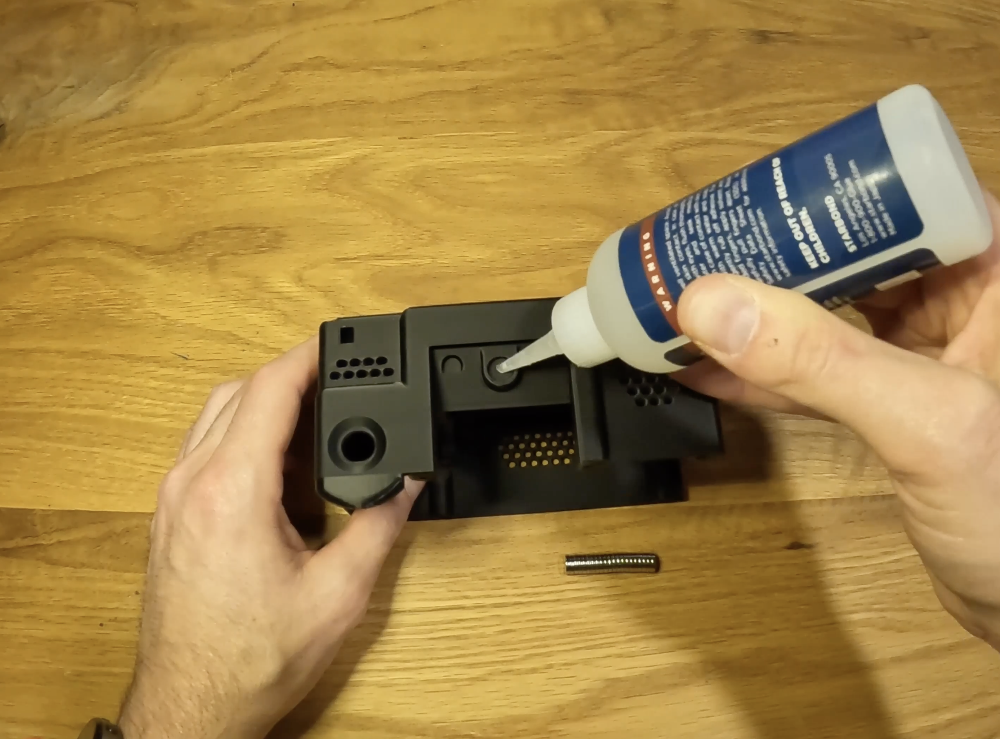

   *Photo 1 — Top-door magnet location in `body_main`.*

   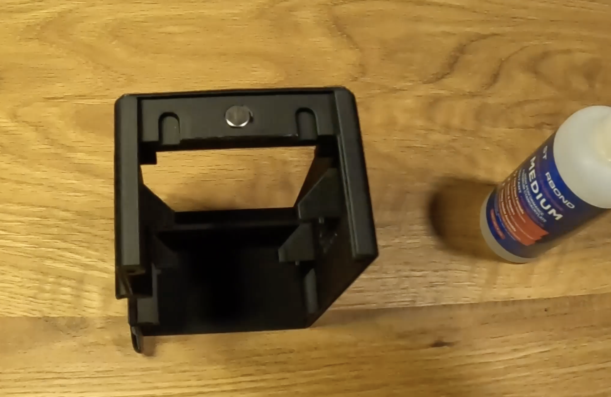

   *Photo 2 — Side-door magnet in place, between the two door-stop clearances.*

4. Install **two M3×4 screws in each door**, four total. These act as stops behind
   `body_front` once assembled. Put one on either side of the magnet, with the
   round heads exposed on the door's inside face as shown below. Check that
   they catch the front cover while allowing the doors to slide; do not bury
   the heads or drive the screws through the door. Exact head dimensions and
   protrusion are still to be measured.

   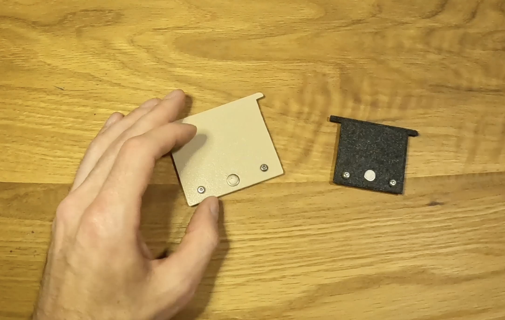

   *Photo 3 — `door_side` on the left has its magnet recess visible;
   `door_top` on the right has its magnet installed. Each door has two stop screws.*

## 2. Mount the display, amplifier, and shutter

Keep PiSugar output off and all external power disconnected during assembly.
Work on a clean, nonconductive surface and protect the display face. Tighten
screws by hand until snug, without bowing boards or stripping printed holes.

5. Fit the display in `body_main`, with its screen facing out through the rear
   opening. Attach it using the **four M2.5 screws supplied with the display**.
   Check that it sits evenly and the board is not bowed.
6. Connect the included ribbon to the back of the display. Open the latch gently,
   insert the ribbon squarely with the correct contact orientation, and close
   the latch. Use the **DSI socket at the board's right edge in photo 4**; leave
   the factory panel ribbon at the centre of the board connected. Leave the
   Pi end of the DSI cable loose.

   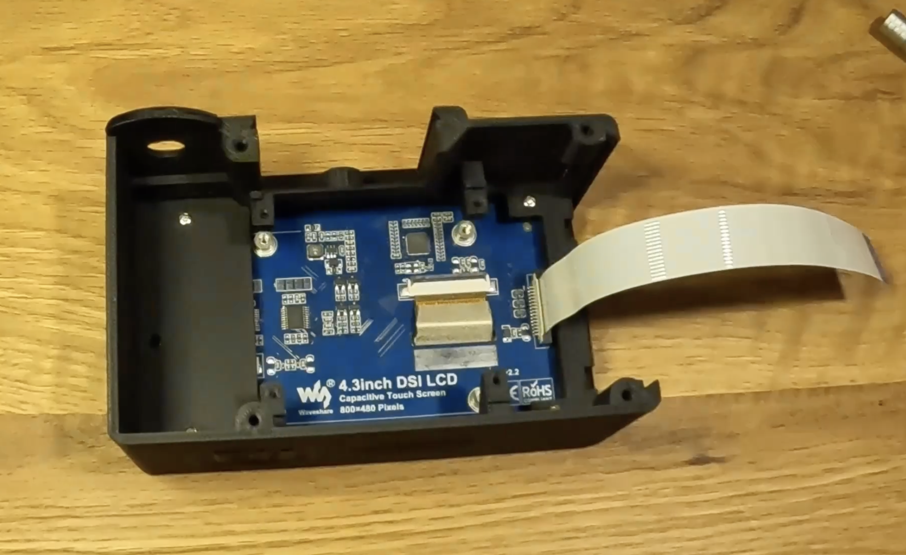

   *Photo 4 — Display attached to `body_main`. The PCB is marked
   `4.3inch DSI LCD`, `800×480 Pixels`, and revision `2.2`.*

7. Attach the amplifier to its single mount in `body_main` with **one M3×6
   screw**. Keep the head clear of pads/components and prevent the board from
   rotating into another board.
8. With the Pi outside the housing, connect amplifier **VIN → pin 4; GND → pin
   6; BCLK → pin 12; LRC/LRCLK → pin 35; DIN → pin 40**. These are physical
   header numbers. Use the [wiring reference](WIRING.md#gpio-connections) to
   match terminal labels, and insulate any splices.
9. Insert the 10 mm switch's leads and threaded barrel through the shutter
   opening from outside. Secure it with the supplied nut inside `body_main`.
   Tighten without twisting the leads or distorting the housing, and check
   that the button moves and releases freely.
10. Connect its normally-open contacts to **physical pin 38 (GPIO20)** and
    **physical pin 39 (ground)**. The leads have no polarity. Pin 40 belongs to
    audio. A continuity check should show open when released and closed only
    while pressed.

## 3. Connect and mount the Pi and PiSugar

Prepare the microSD card with the OS, Wi-Fi, and SSH settings in
[DEVICE.md](../docs/DEVICE.md#prepare-raspberry-pi-os). Insert it before mounting
the Pi if access will be restricted. Install the application at first boot below.

11. Connect the display ribbon to the Pi's **DISPLAY / DSI** connector. Connect
    one end of the camera ribbon to the Pi's **CAMERA / CSI** connector; leave
    the camera end loose until assembling the lens mount. Check latches and contact orientation
    using the [connector references](WIRING.md#camera-display-and-battery).

    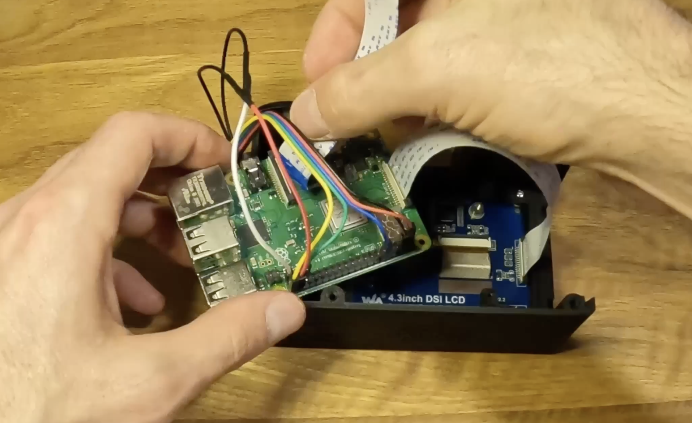

    *Photo 5 — Connect the GPIO leads and ribbons while the Pi is accessible.
    It is shown component side up here and is flipped over in the next step.
    Use the [numbered pin table](WIRING.md#gpio-connections) for wiring; some
    header connections are hidden in this photo.*

12. Set the Pi into `body_main` with its **component side facing down toward
    the back of the display**, aligning all four mounting holes. Keep every
    cable clear of the screw posts and the gap between the Pi and its mounts.
    Check that Pi components do not press against the display PCB.
13. Place PiSugar against the **underside of the Pi**, aligning its spring
    contacts with the GPIO solder pads and its four holes with the Pi's holes.
    Follow [PiSugar mounting preparation](https://docs.pisugar.com/docs/product-wiki/battery/pisugar3/pisugar-3-series),
    removing protective film from its mounting nuts if present. Hold the boards
    together at their mounting areas, avoiding pressure on the battery pouch.
14. While holding PiSugar in place, pass the **four supplied M2.5 screws**
    through PiSugar and Pi mounting holes into `body_main`, as specified for
    this enclosure. Start all four, then gently tighten diagonally. Check that
    the boards stay parallel and the spring contacts seat firmly. The battery
    faces the open front of the housing as shown in photo 6. Exact M2.5 screw
    lengths and board spacing still need measurement: stop if a screw bottoms out,
    fails to engage, bows a board, or approaches the battery. Do not force a
    longer screw into place.

    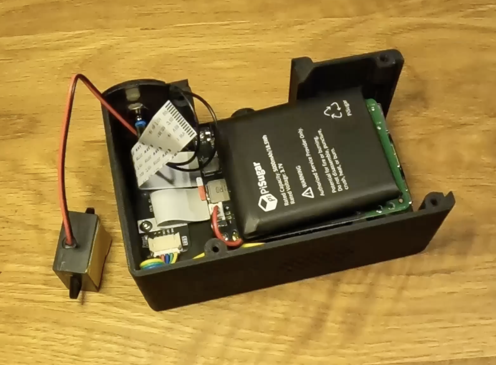

    *Photo 6 — From the display toward the open front: Pi component side,
    Pi underside, PiSugar, then battery. Keep ribbons and leads clear of the
    mounting posts. The amplifier sits beside the stack.*

15. Slide both doors into their matching positions. Check magnetic attraction
    and free movement. Their stop screws are captured by the front cover later,
    so support the doors while handling the open body.

## 4. Assemble the camera mount

16. Set Camera Module 3 onto the locating pins on `lens_back`, aligning the PCB
    holes and ribbon connector with the mount. Handle it by its board edges.
    The lens must face through the opening in `lens_front`. If latch access is
    easier now, connect the camera end of the ribbon before seating the module,
    as in photo 7; keep the cable loose while assembling the mount.

    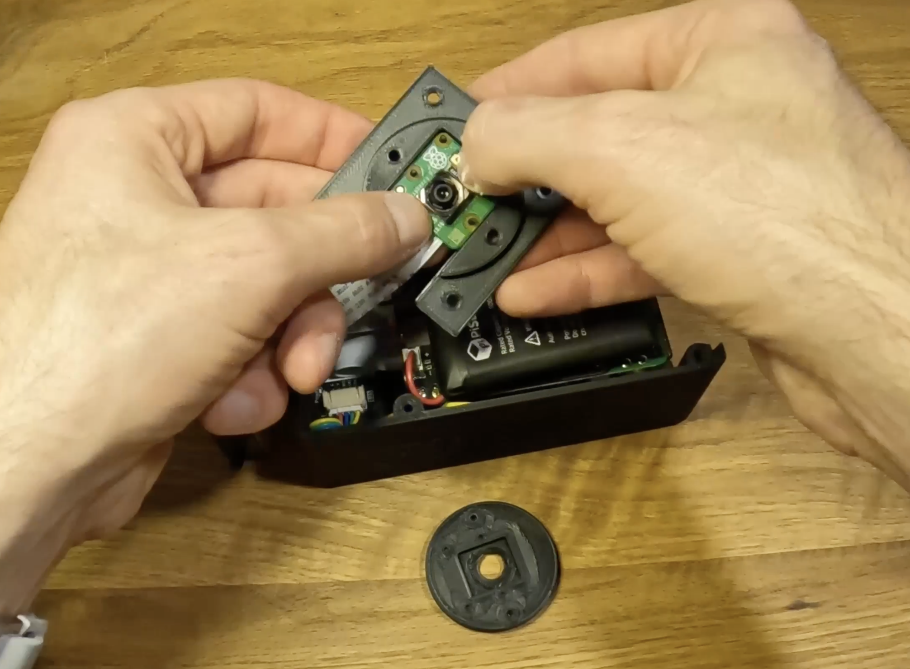

    *Photo 7 — Seat the camera in `lens_back`. The round `lens_front` lies below,
    with its inside face visible. The camera ribbon is already connected in
    this example.*

17. Place `lens_front` over the camera and `lens_back`, aligning the pins with
    its rear holes. The halves should sandwich the board without bending it or
    pressing on the lens actuator or ribbon connector.
18. Join the halves with **two M3×8 screws**, inserted from the rear of
    `lens_back` into `lens_front`. Use the two inner holes beside the camera
    cutout; reserve the four outer flange holes for mounting to `body_front`.
    Tighten evenly, just enough to retain the camera. Remove print debris and
    any removable lens protector. Check clearance around the moving lens;
    do not use screws to pull a binding mount together.

    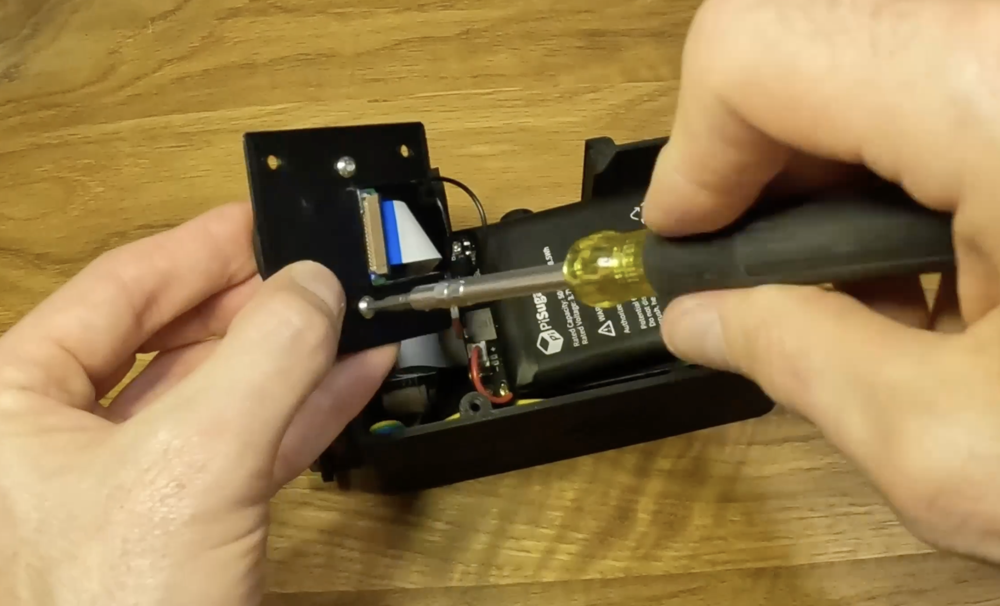

    *Photo 8 — The two inner M3×8 screws hold the lens halves together.
    The ribbon connector remains accessible through the rear cutout.*

19. If not already connected, attach the ribbon from the Pi to Camera Module 3.
    Check contact orientation, seat it squarely, and close the latch. Leave a gentle service
    loop so moving the front cover will not tug on the socket.

## 5. Prepare the front cover

20. Fit the lens assembly into `body_front`, with `lens_front` projecting
    through the opening and the `lens_back` flange on the inside. Align the
    four mounts and leave the ribbon exit clear, as in photo 9.
21. Attach the lens assembly to `body_front` with **four M3×6 screws** through
    the outer flange holes, working from inside the front cover. Tighten evenly
    without stressing the camera board. These are separate from the two inner
    screws that hold the lens halves together.

    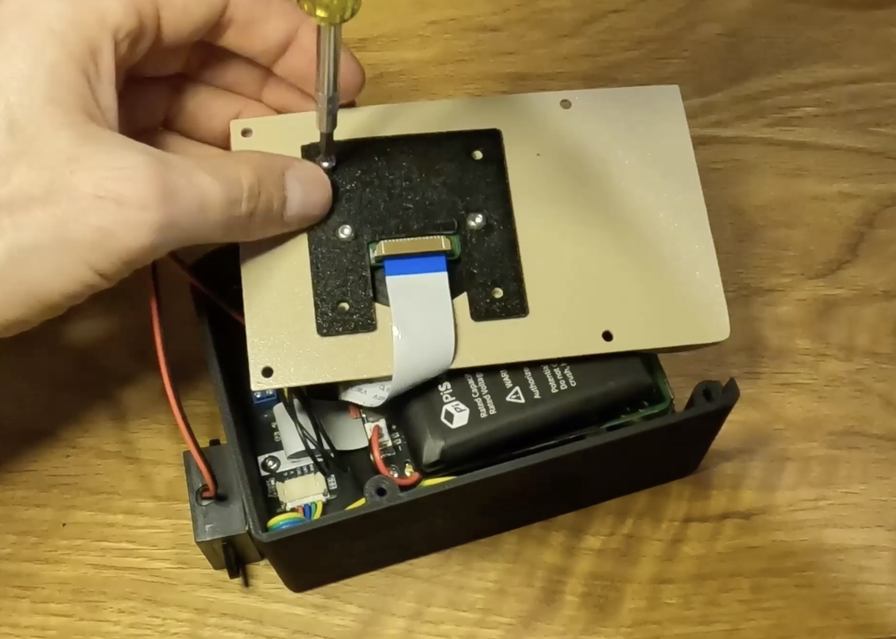

    *Photo 9 — Inside face of `body_front`: the lens flange sits against the
    panel, and the camera ribbon exits through its open notch. The four holes
    near the panel edges are for attaching the complete front cover later.*

22. Attach the speaker's flat back to the inside of `body_front`, beside the
    lens mount, using double-sided tape. The **speaker cone faces into the
    housing**, as in photo 10. Keep tape off the cone and sound openings;
    the speaker's mounting tabs do not need screws in this build. Connect
    its leads to the amplifier's speaker output; neither lead goes to Pi ground.
    Support the front cover beside the body so cables carry no weight.

    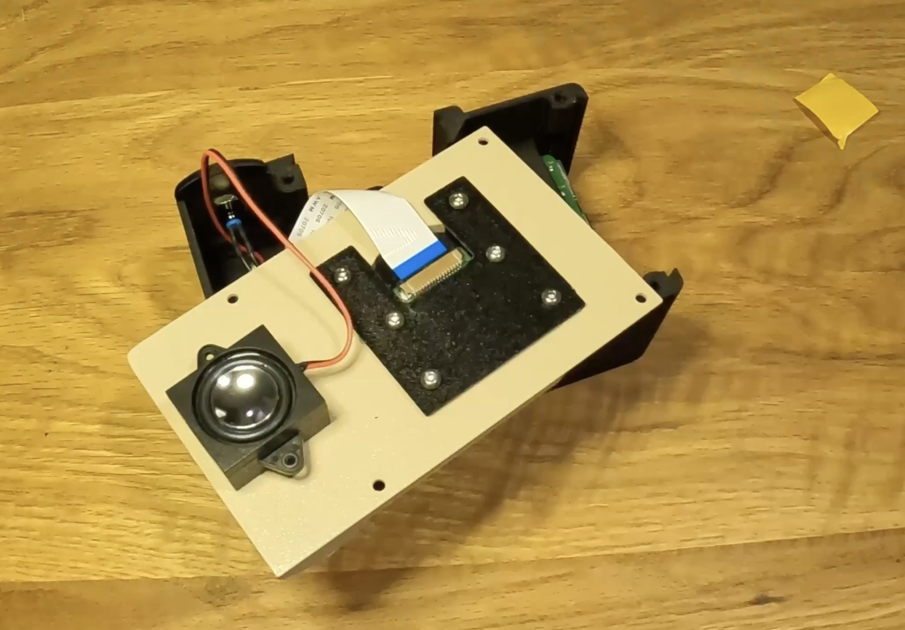

    *Photo 10 — Completed inside face of the front cover, with the speaker
    beside the lens assembly and both cables free to route into `body_main`.*

## 6. Install the software and test before closing

Inspect for loose metal, exposed connections, misplaced GPIO leads, trapped
cables, and screws touching the battery or components. Then turn on PiSugar.
Keep the front cover supported and accessible for the first test; power off
again before changing any connection.

Follow [DEVICE.md](../docs/DEVICE.md) for OS setup and device registration.
For **this camera**, install with:

```bash
curl -fsSL https://raw.githubusercontent.com/danny-hines/muse-cam/main/scripts/install-device.sh \
  | sudo bash -s -- --profile pi3bplus-cam3-dsi43 --claim YOUR-SETUP-CODE
```

The installer may reboot when hardware configuration changes. Then complete:

- **Battery:** follow [POWER.md](../docs/POWER.md#pisugar-3-plus-setup) to install
  PiSugar Power Manager, enable I²C, and set `MUSECAM_POWER_BACKEND=pisugar3` in
  `/etc/musecam/device.env`. Select **PiSugar 3** in the manager, including for
  Plus boards. Battery reporting alone does not configure safe shutdown.
- **Audio:** follow [amplifier setup](../docs/DEVICE.md#amplifier-and-speaker-bring-up)
  to compile and enable `musecam-i2s-output` followed by `max98357a,no-sdmode`.
  This manual step keeps GPIO20 free for the shutter.

After the required reboot, run diagnostics:

```bash
sudo systemctl stop musecam
sudo -u musecam /opt/muse-cam/.venv/bin/musecam \
  --config /etc/musecam/device.env doctor
sudo systemctl start musecam musecam-kiosk
```

Check before fitting the front cover:

- Preview is upright, unobstructed, and focused at near and far distances.
  Inspect an original photo, not just an AI result. **Camera Module 3 autofocus
  remains unresolved in the existing prototype test record**; see
  [camera results](../docs/CAMERAS.md#camera-module-3-initial-hardware-results--2026-09-12).
  Resolve binding or persistent blur before closing the camera.
- Touch controls work, and each shutter press produces one capture. Try at least
  ten captures, including a few close together.
- Settings → Sounds plays clean cues at low volume.
- Battery percentage appears after PiSugar setup, and the camera runs on battery
  with the charger removed.
- A capture, processing, and gallery-viewing cycle succeeds over Wi-Fi. Test
  sharing only with an image intended for the public roll.

## 7. Close the camera and check the finished build

23. Shut down the Pi cleanly, wait for it to halt, and turn off PiSugar output.
    Place `body_front` over `body_main`. Keep cables away from the seam, door
    tracks, and screw posts. Both stop screws on each door must sit behind the
    front cover.
24. Attach `body_front` using the final **four M3×6 screws**. Tighten evenly
    without forcing the seam closed. Check that doors remain retained, the
    shutter moves freely, and charging/service openings are accessible. Slide
    `door_side` toward the camera front to expose the Pi's USB and Ethernet
    ports, as in photo 14. Check that its stop screws limit travel and keep
    it captured, then close it so the magnets meet.

Power up and repeat preview, focus, touch, shutter, speaker, and battery checks
with the enclosure closed. Confirm a normal shutdown/restart and charging through
the PiSugar port. Run long enough to observe heat and battery runtime; record
actual test duration, temperature, and results before claiming expected runtime
or thermal performance for the enclosure.

### Completed camera

These finished builds show the exterior in cream/black and orange/white.
Use them to compare the front-cover fit, lens opening, display surround,
shutter position, and side-door movement. Wrist straps shown here are optional.


*Photo 11 — Front cover fastened at its four corners, with the lens centred in
the opening and the side door closed.*

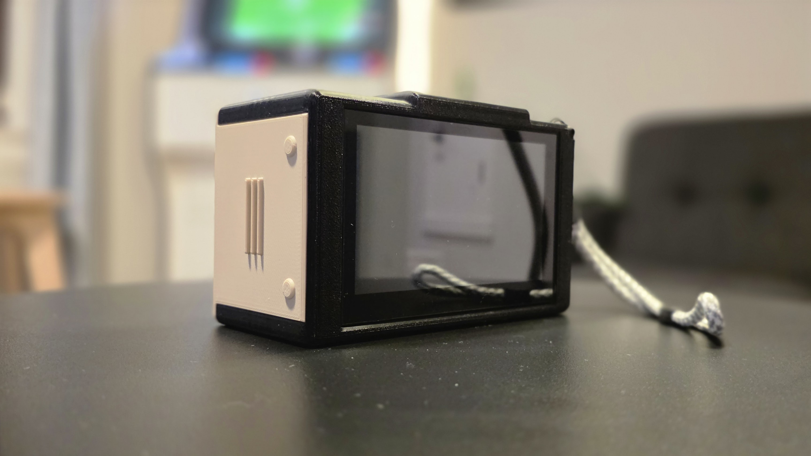

*Photo 12 — Rear touchscreen and closed side door. The strap is an optional
accessory; it is not part of the six printed pieces.*

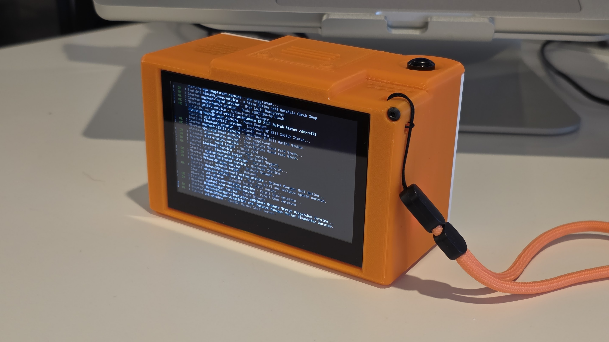

*Photo 13 — Top door, shutter, and rear display on the orange build. The screen
shows the operating system booting.*

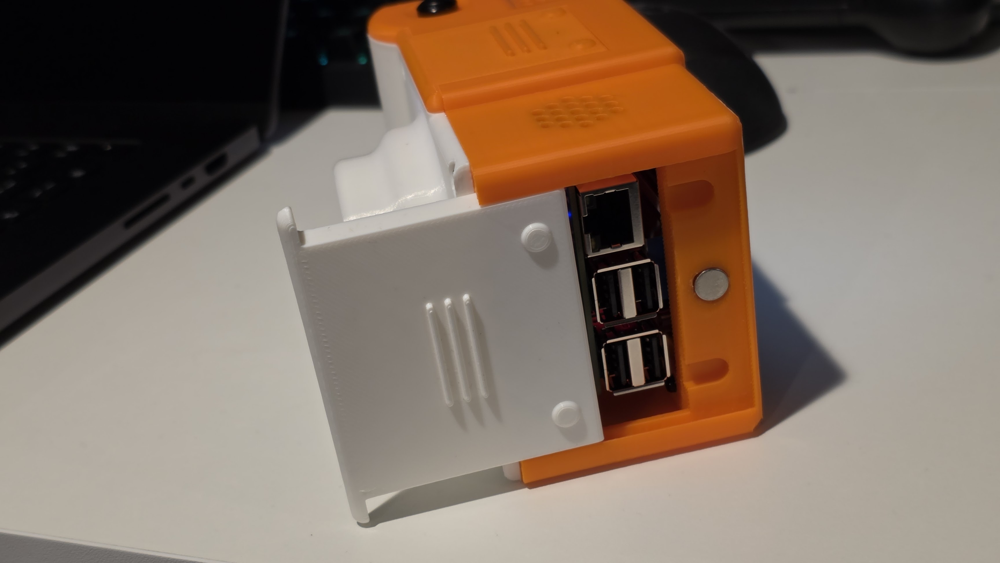

*Photo 14 — Side access door open: Ethernet at the top and the stacked USB ports
below it in this view. The body magnet is visible beside the ports.*

## Remaining measurements and checks

Photos 1–10 document magnet locations, door stops, the display and Pi/PiSugar
arrangement, the lens sandwich and flange, and speaker placement. Photos 11–14
show the completed exterior and side-port access. The following details still
need measurements or functional checks:

| Needed | What it resolves |
| --- | --- |
| Printed parts on the print bed, plus slicer settings | Material, orientation, supports, nozzle, layer height, walls, infill, and scale |
| Door-stop screws and their installed height measured | Exact head dimensions, thread form, and protrusion |
| Ribbons laid out with a ruler; unobstructed views of connector contacts | Cable lengths and contact orientation at each end |
| Amplifier connector labels and speaker rear label | Harness lead order, speaker impedance and dimensions |
| Pi/PiSugar stack from the side; supplied screws beside a ruler | M2.5 lengths and board spacing |
| Near/far focus test with the camera in its printed mount | Lens movement, clearance, and focus performance |
| Door travel and access to power/charging controls tested on the assembled unit | Both doors remain captured and controls/charging connector can be reached; side USB/Ethernet access is shown in photo 14 |

Editable CAD, the final mechanical revision name, and a completed physical build
using the recorded print settings are still pending.
