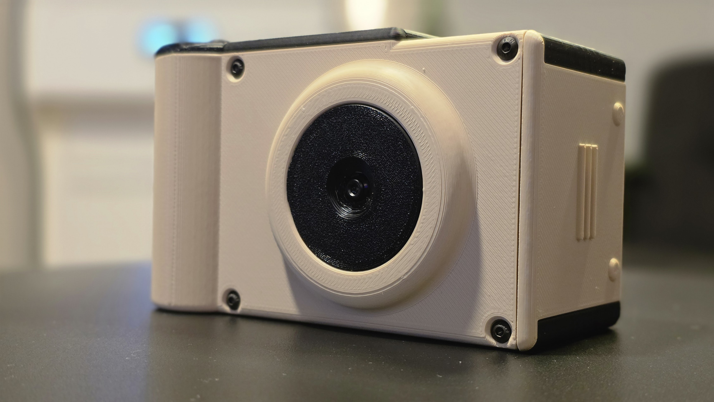

# Build a Muse Cam

Print the six enclosure parts, gather the [parts list](BOM.md), and follow the
[assembly guide](BUILD.md). Keep the [wiring reference](WIRING.md) nearby while
connecting the amplifier and shutter.

The completed camera. See [front, rear, and open-door views](BUILD.md#completed-camera)
in cream/black and orange/white.

## Current build

The September 16, 2026 instructions cover Danny's enclosure with:

- Raspberry Pi 3 Model B+.
- Raspberry Pi Camera Module 3 Standard.
- Waveshare 4.3-inch 800×480 DSI touchscreen.
- PiSugar 3 Plus and battery.
- MAX98357A I²S amplifier and 3 W speaker kit.
- A 10 mm momentary shutter switch and magnet-retained access doors.

Use software profile `pi3bplus-cam3-dsi43` with
`MUSECAM_POWER_BACKEND=pisugar3`. The shutter connects to physical pins **38 and
39**; physical pin **40** is reserved for amplifier DIN.

## Files

| Resource | Contents |
| --- | --- |
| [Parts list](BOM.md) | Purchase links, quantities, screws, cables, and supplies |
| [Build guide](BUILD.md) | Printing, assembly, software setup, and final checks |
| [Build photos](photos/README.md) | Ten assembly photos and four completed-camera views |
| [Wiring reference](WIRING.md) | Physical pin numbers, BCM GPIO numbers, and audio setup |
| [STL files](stl/README.md) | Six original exports, dimensions, and SHA-256 checksums |
| [Source CAD](cad/README.md) | Location for editable models; source files are still pending |
| [Earlier concepts](concepts/README.md) | Illustrative concepts; use the supplied STLs for this build |
| [Device setup](../docs/DEVICE.md) | OS installation, diagnostics, and operation |
| [Battery setup](../docs/POWER.md) | PiSugar 3 Plus telemetry and power-manager configuration |

## Build status

An enclosed prototype has processed photos over Wi-Fi, and its amplifier/speaker
has played clean audio. Application sound cues are implemented. Camera Module 3
preview/capture were checked on September 12, and PiSugar 3 Plus battery reporting
on September 13; see [camera results](../docs/CAMERAS.md) and
[power results](../docs/POWER.md).

The guide includes **ten assembly photos and four completed-camera views**
showing the four-magnet layout, door stops, display, Pi/PiSugar stack, lens mount,
speaker placement, and side-door access to USB and Ethernet. The six
supplied STLs are unchanged, with file-integrity and dimension checks. Print
settings, exact screw-head dimensions and M2.5 lengths, cable lengths, and some
connector details still need to be recorded. Camera Module 3 autofocus remains
unresolved in the existing test record, so check lens clearance and near/far
focus before closing the housing.

The assembly guide lists the remaining measurements and checks. Other
software-supported cameras and displays are listed in
[DEVICE.md](../docs/DEVICE.md); their mechanical fit is not established by this
STL set.
